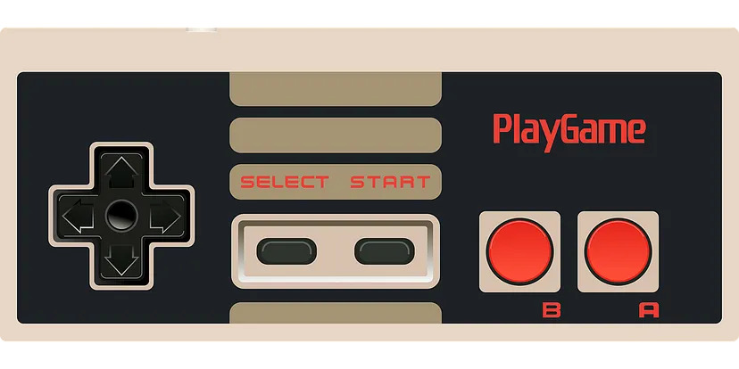

# Home

Skills: `python` `RStudio` `R programming`

Welcome to my portfolio! Scroll down to view my projects.

  

    
    

      <h3>Project 1</h3>
      
Description for project 1.

    

  

  

    
    

      <h3>Project 2</h3>
      
Description for project 2.

    

  

  

    
    

      <h3>Project 3</h3>
      
Description for project 3.

    

  

