Introduction
============

> <div class="project-skills">
        <strong>Skills:</strong>
        <span class="skill-tag">R</span>
        <span class="skill-tag">Excel</span>
  </div>

> Data found on: [Kaggle](https://www.kaggle.com/datasets/gregorut/videogamesales) Original data source: [VGChartz](https://www.vgchartz.com/)

### **Initial Assumptions**

Based on my background and love for video games, I have a few assumptions I expect to see during and after performing this analysis:

- **Nintendo** will be the dominant developer/publisher for *a lot* of years. It's impressive how Nintendo manages to never significantly change their business model or way of developing games but still continue to release popular games that appeal to a vast audience.
- **PlayStation 2** was massive. There will be a spike in the year 2000/2001 right when it was released and it will be the top console platform.
- **Grand Theft Auto: V** is a timeless game released in 2013, that's still widely popular to this day. I expect to see that reflected in the data from 2013--2016, since the data set only records data until 2016 (there are points for 2017--2020 but only 4).
- **Wii Sports** will have a lot of sales, maybe even the top selling game, higher than the likes of Call of Duty, GTA V, and Super Mario. Wii Sports was innovative. It was the first of its kind and brought family gaming of all ages right there into the home.
- **World of Warcraft** was a revolutionary game that changed the MMO scene. I expect it to be one of the top games across the board.
- **Atari** was a big contributor to the game market crash of the 1980s. I expect to see a drastic drop in sales during this time period.
  
### **Questions**

1. Which company had the top sales?
2. Is there a correlation between platform and sales?
3. Which game sold the most and why?
4. Which platform(s) are most people using?
5. Who is publishing the most games? Does that necessarily mean they have the most sales?

Let's get right into it by first loading necessary libraries and the data set:

```R
# libraries used
library(ggplot2)
library(dplyr)
library(ggrepel)  
library(dlookr)
library(skimr)
library(plyr)
library(ggpubr)
library(gganimate)
library(ggcorrplot)
library(DataExplorer)
library(lubridate)

# load and view first 10 rows of data set
vgsales <- read.csv("vgsales.csv", header = TRUE)
head(vgsales)
```

*Quick note: I reference packages throughout the code. For example, the glimpse() function will be denoted dplyr::glimpse() since it's from the dplyr package. Shoutout to *[*Kinga on LinkedIn*](https://www.linkedin.com/feed/update/urn:li:activity:7054072731482390529?updateEntityUrn=urn%3Ali%3Afs_feedUpdate%3A%28V2%2Curn%3Ali%3Aactivity%3A7054072731482390529%29)* for this tip!*

<div style="text-align: center; padding: 20px 0; letter-spacing:10px;">• • •</div>

### **Data Exploration**

As always, the first step should be to explore our data set and get familiar with it. One package I recently discovered and have fallen in love with for this step is the “DataExplorer” package. We’ll use this package along with a couple others to understand the data structure, find missing values, explore outliers, and visualize distributions of the data.

#### **Data Structure**

```R
# provides a summary of each column  
summary(vgsales)

# another way to get more information about each column
dplyr::glimpse(vgsales)
```

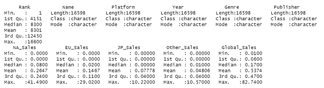
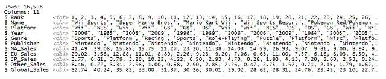

Just from looking at these two summaries, there are going to be “outliers”. For example, looking at Global_Sales, the median is 0.17 while the maximum value is 82.74. This is expected since we’re talking about video game sales from notable companies like Nintendo, Sony, Electronic Arts, and Activision, where there are going to be games that blow up at certain times. We can tell that the sales data is heavily right skewed by looking at the summary statistics, as there’s a wide range between the values. We’ll decide what to do with this later on (will likely perform analysis with them included regardless), but let’s move on to tidying our data set.

<div style="text-align: center; padding: 20px 0; letter-spacing:10px;">• • •</div>

#### **Missing Values**

When exploring the data set, I noticed 271 missing data points in “Year” and 261 in “Publisher” that had values of string “N/A” in the Year and Publisher column, as well as “Unknown” in the Publisher column. Let’s find out more using dplyr, skimr, and DataExplorer:

```R
# replace string "N/A" with NA to use is.na() function
vgsales[vgsales == "N/A"] <- NA
vgsales[vgsales == "Unknown"] <- NA

# sum of all missing data points in each column
vgsales %>%
  dplyr::select(everything()) %>%
  dplyr::summarise_all(funs(sum(is.na(.))))

# visualize missing points by column
DataExplorer::plot_missing(vgsales)
```

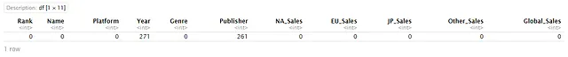
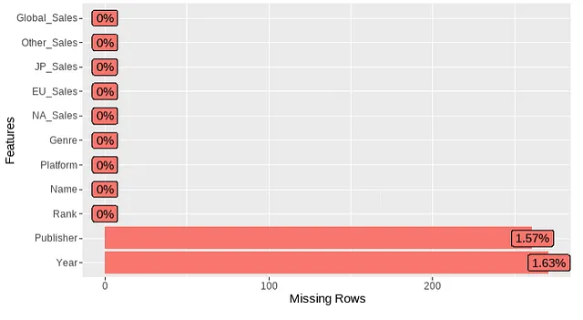

In the context of video games, this is weird since video game release dates and publishers are usually readily available. Perhaps there was an issue with the web scraping or the original source (VGChartz) had data entry errors or a malfunction in their data collection process.

Since these data points are missing at random (MAR) and the percentage of missing observations is low relative to total observations, we could perform listwise deletion or imputation. However, I decide against it to keep the data as accurate as possible. If anyone has thoughts on this decision, feel free to leave a comment, as I’m still trying to deeply understand when to and not to use imputation. For this analysis, I performed data entry in Excel for the information I could find and loaded the new cleaned set. We’ll use this data set from here on out.

```R
# replace string "N/A" with NA to use is.na() function
vgsales[vgsales == "N/A"] <- NA
vgsales[vgsales == "Unknown"] <- NA

# sum of all missing data points in each column
vgsales %>%
  dplyr::select(everything()) %>%
  dplyr::summarise_all(funs(sum(is.na(.))))

# visualize missing points by column
DataExplorer::plot_missing(vgsales)
```
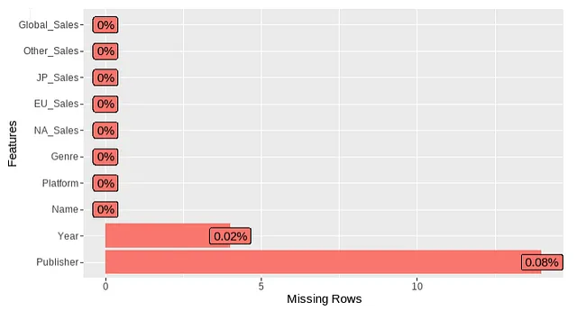
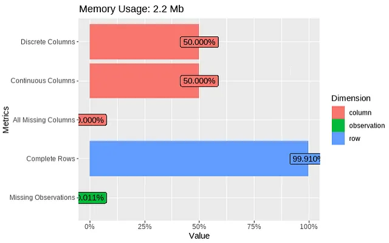

Now we have much less missing observations! Let’s continue exploring the data using a few nifty R functions:

```R
# summarize categorical variables
dlookr::diagnose_category(vgsales_clean)
```

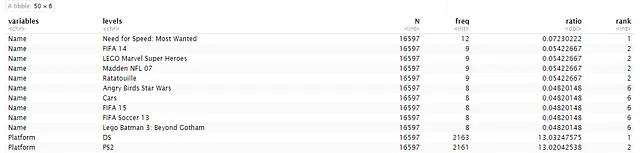

```R
# more summary statistics for each column
vgsales_skim <- vgsales_clean %>%
  skimr::skim()
data.frame(vgsales_skim)
```
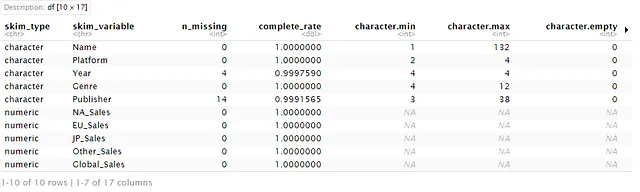
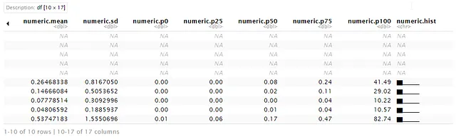

I love the skim() function in skimr because it provides histogram sparklines so you can quickly see the distribution of numeric variables. That’s a good segue into our next data exploration topic.

<div style="text-align: center; padding: 20px 0; letter-spacing:10px;">• • •</div>

#### **Distribution of Data**
Firstly, let’s calculate descriptive statistics for the sales data:

```R
# function to calculate mode. R does not have a built-in 
# function for mode like median and mean!
Mode <- function(x) {
  ux <- unique(x)
  ux[which.max(tabulate(match(x, ux)))]
}

# get the standard deviation and mode for each sales column and store in a data frame
df_stats <- data.frame(std = c(sqrt(var(vgsales_clean$NA_Sales)), 
                               sqrt(var(vgsales_clean$EU_Sales)), sqrt(var(vgsales_clean$JP_Sales)),
                               sqrt(var(vgsales_clean$Other_Sales))), 
                       mode = c(Mode(vgsales_clean$NA_Sales), 
                                Mode(vgsales_clean$EU_Sales),
                                Mode(vgsales_clean$JP_Sales),
                                Mode(vgsales_clean$Other_Sales)))
row.names(df_stats) <- c("NA_Sales", "EU_Sales", "JP_Sales", "Other_Sales")
df_stats
```
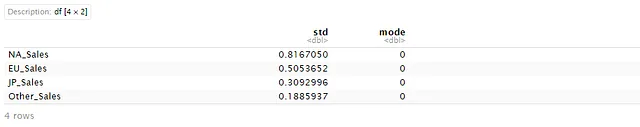

Next, let’s take a look at the distribution of data by plotting histograms of each:

```R
NA_hist <- ggplot(vgsales_clean, aes(x = NA_Sales)) +
  ggplot2::geom_histogram(color = '#1ab5fb', bins = 50) +
   geom_vline(aes(xintercept = mean(vgsales_clean$NA_Sales)), col = 'red', linetype = 'dashed') +
   geom_vline(aes(xintercept = median(vgsales_clean$NA_Sales)), col = 'blue', linetype = 'dashed') +
   geom_vline(aes(xintercept = Mode(vgsales_clean$NA_Sales)), col = 'green', linetype='dashed') +
   xlab("Sales in North America (in millions)") + ylab("frequency")

EU_hist <- ggplot(vgsales_clean, aes(x = EU_Sales)) +
  ggplot2::geom_histogram(color = '#1ab5fb', bins = 50) +
   geom_vline(aes(xintercept = mean(vgsales_clean$EU_Sales)), col = 'red', linetype = 'dashed') +
   geom_vline(aes(xintercept = median(vgsales_clean$EU_Sales)), col = 'blue', linetype = 'dashed') +
   geom_vline(aes(xintercept = Mode(vgsales_clean$EU_Sales)), col = 'green', linetype='dashed') +
   xlab("Sales in Europe (in millions)") + ylab("frequency")

JP_hist <- ggplot(vgsales_clean, aes(x = JP_Sales)) +
  ggplot2::geom_histogram(color = '#1ab5fb', bins = 50) +
   geom_vline(aes(xintercept = mean(vgsales_clean$JP_Sales)), col = 'red', linetype = 'dashed') +
   geom_vline(aes(xintercept = median(vgsales_clean$JP_Sales)), col = 'blue', linetype = 'dashed') +
   geom_vline(aes(xintercept = Mode(vgsales_clean$JP_Sales)), col = 'green', linetype='dashed') +
   xlab("Sales in Japan (in millions)") + ylab("frequency")

Other_hist <- ggplot(vgsales_clean, aes(x = Other_Sales)) +
  ggplot2::geom_histogram(color = '#1ab5fb', bins = 50) +
   geom_vline(aes(xintercept = mean(vgsales_clean$Other_Sales)), col = 'red', linetype = 'dashed') +
   geom_vline(aes(xintercept = median(vgsales_clean$Other_Sales)), col = 'blue', linetype = 'dashed') +
   geom_vline(aes(xintercept = Mode(vgsales_clean$Other_Sales)), col = 'green', linetype='dashed') +
   xlab("Sales in the rest of world (in millions)") + ylab("frequency")

# arrange the graphs into a simple dashboard
ggpubr::ggarrange(NA_hist, EU_hist, JP_hist, Other_hist)
```

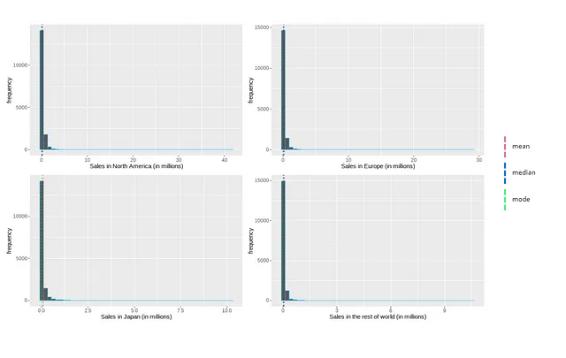

Although this may look abnormal, it makes sense as this data represents video game sales. The gaming market is heavily saturated and most games are released into the abyss, receiving little to no traction. The sales distribution reflects that as the most frequent sales are between 0 and 2 million, with a few widely popular games creating a positive (right) skew.

<div style="text-align: center; padding: 20px 0; letter-spacing:10px;">• • •</div>

#### **Correlation**
First, I’ll create a correlation matrix using the ggcorrplot() function in the ggcorrplot library:

```R
# create rounded matrix of sales data
correlation <- round(stats::cor(vgsales_clean[6:9]), 2)
# plot correlation matrix
ggcorrplot::ggcorrplot(correlation, outline.col = "white", type = "lower",
           ggtheme = ggplot2::theme_gray,
           colors = c("#800020", "white", "#008000"),
           lab = TRUE, lab_size = 2.5)
```

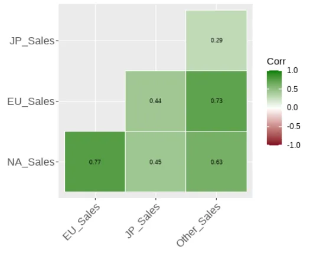

Let’s also visualize this using scatter plots. Note that all units for sales are in millions.

```R
NA_EU <- ggplot(vgsales_clean, aes(x=NA_Sales, y = EU_Sales)) +
  geom_point(color = "#1ab5fb")
NA_JP <- ggplot(vgsales_clean, aes(x=NA_Sales, y = JP_Sales)) +
  geom_point(color = "#5d93fd")
NA_Other <- ggplot(vgsales_clean, aes(x=NA_Sales, y = Other_Sales)) +
  geom_point(color = "#7473fb")
EU_JP <- ggplot(vgsales_clean, aes(x=EU_Sales, y = JP_Sales)) +
  geom_point(color = "#7ed957")
EU_Other <- ggplot(vgsales_clean, aes(x=EU_Sales, y = Other_Sales)) +
  geom_point(color = "#ff66c4")
JP_Other <- ggplot(vgsales_clean, aes(x=JP_Sales, y = Other_Sales)) +
  geom_point(color = "#ff914d")

ggpubr::ggarrange(NA_EU, NA_JP, NA_Other, EU_JP, EU_Other, JP_Other)
```

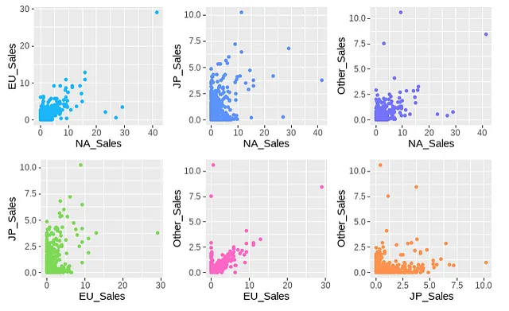

By looking at the correlation matrix and scatter plots, we can see that NA_Sales + EU_Sales and EU_Sales + Other_Sales have the strongest positive correlation, while others like NA_Sales + JP_Sales are lower. This could be due to a multitude of reasons including, but not limited to:

- North America and Europe are big markets with similar audiences for gaming, maybe companies market towards these two regions in similar fashions.
- A lot of NA and EU are in the western world, which could explain similar purchasing trends.
- Western gaming preferences are completely different from the eastern world, which can explain why NA and EU have lower correlation with Japan sales.

After all, correlation does not imply causation! Therefore, we can’t be certain by just looking at the sales data.

<div style="margin-left: 20px;">
<span style="font-size: 1.5em; font-weight: 200;">Correlation does not imply causation.</span>
</div>

<div style="text-align: center; padding: 20px 0; letter-spacing:10px;">• • •</div>

### **Analysis**
Now that we’ve explored the dataset and its structure, let’s get into some analysis and answer some questions! Let’s first take a look at the top 10 games at a global level:

```R
# get top 10 games by global sales and plot them
dplyr::slice_max(vgsales_clean, n=10, order_by=vgsales_clean$Global_Sales) %>%
          ggplot(., aes(x=reorder(Name, Global_Sales), y=Global_Sales)) +
              ggplot2::geom_bar(stat="identity", fill=alpha("#1ab5fb",0.8)) +
              ggplot2::geom_text(aes(label=Publisher)) +
              ggplot2::labs(x ="Game", y = "Global_Sales (in millions)") +
              ggplot2::coord_flip()

# data frame of more detailed info for the top 10 games
dplyr::slice_max(vgsales_clean, n=10, order_by=vgsales_clean$Global_Sales)
```

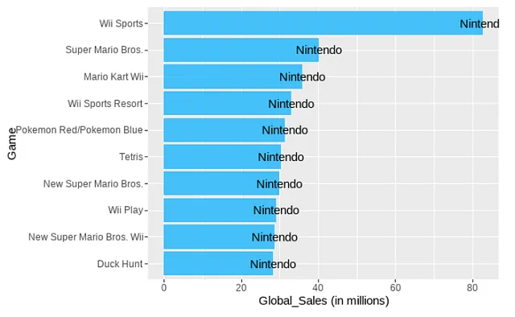

As expected, Nintendo is dominant in this dataset which contains records from 1977 to 2016. They took every spot for the top 10 games! And Wii Sports tops the chart without competition. That really puts in to perspective how revolutionary the concept of Wii Sports was.

Another way to put Nintendo's fame into perspective is by comparing to World of Warcraft (WoW) by Activision Blizzard. In my initial assumptions, I thought WoW would be a top selling game (probably a bit of personal bias there), which it is, but Nintendo blows it out of the water. There are a few factors that may have caused this:

- Nintendo sells on multiple different platforms while WoW is PC exclusive.
- Nintendo has been around longer and have a bigger global reach with classic games like Super Mario Bros, Pokemon, and Tetris.
- Personal computers (PC) had a higher barrier to entry. It was much easier and cheaper to purchase consoles, especially convenient handheld devices that Nintendo produced.
- 
Let’s take a look at the top 10 when excluding Nintendo:

```R
# filter out all rows containing Nintendo as Publisher
nint_excluded <- dplyr::filter(vgsales_clean, !Publisher %in% c("Nintendo"))

# get top 10 and visualize it
dplyr::slice_max(nint_excluded, n=10, order_by=nint_excluded$Global_Sales) %>%
          ggplot(., aes(fill=Platform, x=reorder(Name, Global_Sales), y=Global_Sales)) +
              geom_bar(stat="identity") +
              geom_text(aes(label=Publisher)) +
              labs(x ="Game", y = "Global_Sales (in millions)") +
              scale_fill_manual(values=c("#1ab5fb", "#c1ff72", "#7473fb", "#5d93fd")) +
              coord_flip()
```

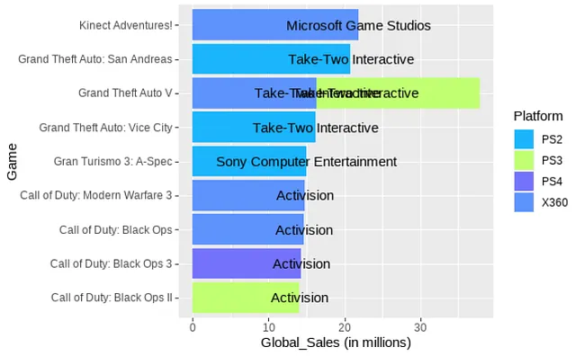

Grand Theft Auto and Call of Duty (Modern Warfare 3 and Black Ops 2 being my personal favorites) across the board! It is crazy to think GTA V has been out for ten years and is still massively popular. Although it does seem like GTA 6 is on the horizon, where <a href="https://x.com/RockstarGames/status/1489617718009606150" target="_blank" rel="noopener noreferrer"><ins>**Rockstar Games tweeted in early 2022**</ins></a> detailing that “active development for the next entry in the series is underway”.

Also, in late 2022 a bunch of leaks came out and <a href="https://x.com/RockstarGames/status/1571849091860029455" target="_blank" rel="noopener noreferrer"><ins>**Rockstar tweeted**</ins></a> to acknowledge the network intrusion which reached over 1 million likes, which really puts into perspective how massive these GTA 6 leaks were.

Back on topic, still no WoW in the top 10! This likely goes back to the point I made above about consoles being cheaper and easier to purchase. PlayStation 2 and Xbox 360 were massive and changed the game for consoles. The technical, graphical, and quality of life (QOL) jump from PlayStation 1 and Xbox was drastic and PC gaming was still a bit niche at this point since PCs were just starting to rise in the market, although growing rapidly.

<div style="margin-left: 20px;">
<span style="font-size: 1.5em; font-weight: 200;">PlayStation 2 and Xbox 360 were massive and changed the game for consoles.</span>
</div>

Let’s take a look at PC games only:

```R
# select rows containing PC in Platform column
PC_only <- vgsales_clean[is.element(vgsales_clean$Platform, c('PC')),]

# get top 10 games by global sales and plot them
dplyr::slice_max(PC_only, n=10, order_by=PC_only$Global_Sales) %>%
          ggplot(., aes(x=reorder(Name, Global_Sales), y=Global_Sales)) +
              ggplot2::geom_bar(stat="identity", fill=alpha("#7473fb",0.8)) +
              ggplot2::geom_text(aes(label=Publisher)) +
              ggplot2::labs(x ="Game", y = "Global_Sales (in millions)") +
              ggplot2::coord_flip()

# data frame of the top 10 for more detailed info
dplyr::slice_max(vgsales_clean, n=10, order_by=vgsales_clean$Global_Sales)
```

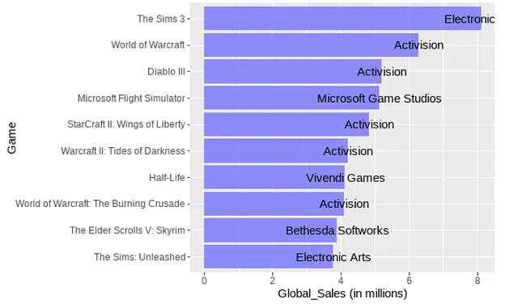

***Wow!*** I knew The Sims 3 was big but did not know it sold more than WoW (no pun intended). In retrospect, it does make sense because The Sims 3 introduced a new, open world and interconnected community experience that imitated real life, which is essentially a Metaverse before the term became mainstream.

World of Warcraft: Wrath of the Lich King was my first WoW, so I’m a bit shocked that it’s not in the top 10. The story of the Lich King/Arthas was a huge attraction in the gaming world because of the character’s development from hero to anti-hero to villain. I mean who hasn’t seen that <a href="https://www.youtube.com/watch?v=BCr7y4SLhck" target="_blank" rel="noopener noreferrer"><ins>***chilling, epic, unnerving cinematic trailer?***</ins></a>

Now, let’s take a deeper look at the different platforms:

```R
# get frequency of each platform and aggregate into a data frame
platform_freq <- plyr::count(vgsales_clean, 'Platform')
platform_sales <- aggregate(list(Global_Sales = vgsales_clean$Global_Sales), list(Platform = vgsales_clean$Platform), sum)

# top 10 platforms by frequency
dplyr::slice_max(platform_freq, n=10, order_by=freq) %>%
          ggplot(., aes(x=reorder(Platform, -freq), y=freq)) +
              ggplot2::geom_bar(stat="identity", fill=alpha("#5d93fd",0.8)) +
              ggplot2::labs(x ="Platform", y = "Frequency") +
              ggtitle("Top 10 Platforms by Frequency") +
              theme(plot.title = element_text(size = 12, face = "bold", hjust = .5))
```

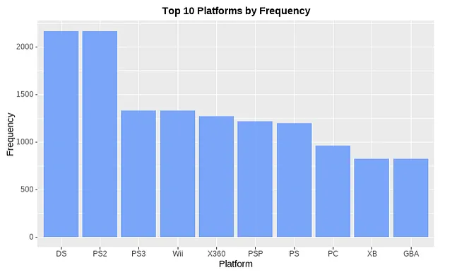

Interesting. Nintendo DS and PS2 are closely battling for the top but how come Wii and Xbox 360 are further down? Some of the biggest games are on those platforms. It’s because we’re looking at frequency. In this case, frequency simply means the amount of games published on these platforms. Let’s look at the top 10 sales by platform:

```R
dplyr::slice_max(platform_sales, n=10, order_by=platform_sales$Global_Sales) %>%
          ggplot(., aes(x=reorder(Platform, Global_Sales), y=Global_Sales)) +
              ggplot2::geom_bar(stat="identity", fill=alpha("#7473fb",0.8)) +
              ggplot2::labs(x ="Platform", y = "Global Sales (in millions)") +
              coord_flip() +
              ggtitle("Top 10 Platforms by Global Sales (in millions)") +
              theme(plot.title = element_text(size = 12, face = "bold", hjust = .5))
```

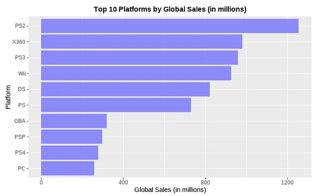

PS2 is still at the top, but now Nintendo DS has dropped and Xbox 360 has risen. While Nintendo DS had more games published on its platform, Xbox 360 had more hits that boosted sales. Now this begs the question of if there is a correlation between global sales and frequency of games published?

```R
# merge the two previous data frames
df_platform <- merge(platform_freq, platform_sales)

# perform a simple linear model
ggplot(df_platform, aes(x=Global_Sales, y = freq)) +
  geom_point(color = "#1ab5fb") +
  geom_smooth(method='lm')
```

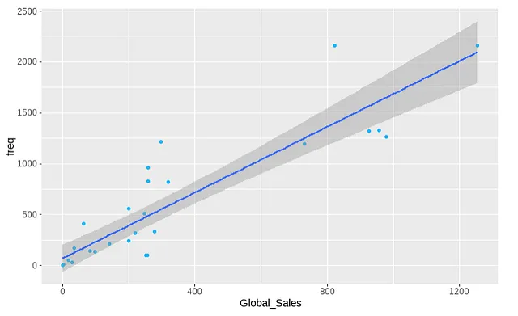

While there does appear to be some positive correlation according to the line of best fit, there's a lot of spread and distance from the line. This makes sense because publishing a lot of games on a platform does not necessarily mean the games will succeed. Although, publishing more frequently can increase the chances of releasing a popular game.

<div style="text-align: center; padding: 20px 0; letter-spacing:10px;">• • •</div>

### Analysis Part 2: Time Series

```R
# aggregate the sum of global_sales for each year
vgsales_global <- aggregate(list(Global_Sales = vgsales_clean$Global_Sales), 
                            list(Year = vgsales_clean$Year), sum)
ggplot(vgsales_global, aes(x=Year, y=Global_Sales, group=1)) +
  geom_line(linetype = 10, color = "darkblue") +
  geom_point(size = 3, color = "#1ab5fb") +
  ggtitle("Number of Global Sales by Year (in millions)") +
  theme(plot.title = element_text(size = 12, face = "bold", hjust = .5),
        axis.text.x = element_text(angle = 45, size = 8))
```

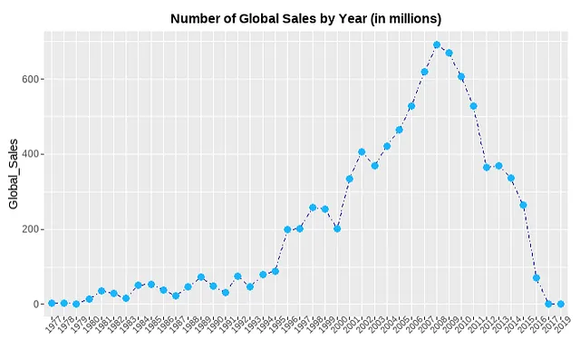

As we can see, at the beginning of the games industry, it took some time for it to grow. Companies were still figuring out this new industry and gaming was heavily stigmatized at this point, so “normal” people were less inclined to become involved with games. Then, in the 90s hit games like DOOM, Half-Life, Pokemon Red/Blue, Crash Bandicoot, and many more came out and paved the way for gaming. In the early 2000s, we have the PlayStation 2 boom, which was a vital step in making gaming accessible and normalized in society. Consoles brought gaming to the home and became a family activity. Then in the mid 2000s-2010s, there was a major shift that made gaming a global phenomenon with the releases of Wii, Call of Duty, Grand Theft Auto, Sims, Halo, and more.

The data starts to drop off after 2014 simply due to a lack of data. However, I would expect the data to stabilize in future years. While popular titles still release today, the huge increase in technological, graphical, and quality of life from the PS1 to PS2 does not occur at that level anymore simply because today’s technology has somewhat reached a peak. Games already look realistic. Performance is top-notch. Equipment and accessories are readily available. Almost every game idea has been done already.

However, we are humans and we naturally innovate towards progress. I’m sure you’ve heard it everywhere by now, but artificial intelligence (AI) has had major advancements and implementations in the real world recently. I believe AI will play a prominent role in gaming, which will create the next boost in game performance and ideas that many gamers are yearning for. 

<div style="margin-left: 20px;">
<span style="font-size: 1.5em; font-weight: 200;">We are humans and we naturally innovate. Companies like <a href="https://www.axios.com/2023/01/06/ea-cto-marija-radulovic-nastic-interview" target="_blank" rel="noopener noreferrer"><ins>Electronic Arts</ins></a> and <a href="https://corp.roblox.com/newsroom/2023/02/generative-ai-roblox-vision-future-creation" target="_blank" rel="noopener noreferrer"><ins>Roblox</ins></a> already have been discussing the potential and plans for AI in games.</span>
</div>

<div style="text-align: center; padding: 20px 0; letter-spacing:10px;">• • •</div>

Let’s have some fun with animation in gganimate by looking at some of the most well known names in the industry.

```R
# store some of the most known publishers in a vector
top_companies <- vgsales_clean[is.element(vgsales_clean$Publisher, c('Activision', 
                                                                     'Electronic Arts', 'Nintendo', 
                                                                     'Ubisoft', 'Take Two Interactive', 
                                                                     'Sony Computer Entertainment')),]

top_companies_sales <- aggregate(top_companies$Global_Sales, by = list(top_companies$Year, 
                                                                       top_companies$Publisher), FUN = sum)
colnames(top_companies_sales)[1] <- "Year"
colnames(top_companies_sales)[2] <- "Publisher"
colnames(top_companies_sales)[3] <- "Global_Sales"

top_companies_sales %>%
mutate(label = if_else(Year == max(Year), Publisher, NA_character_)) %>%
ggplot(., aes(x=Year, y=Global_Sales, group=Publisher, color=Publisher)) +
  geom_line(size = 1, aes(color= Publisher)) +
  ggtitle("Number of Global Sales by Year (in millions)") +
  theme(plot.title = element_text(size = 12, face = "bold", hjust = .5),
        axis.text.x = element_text(angle = 45, size = 8),
        legend.position = "none") +
  geom_label_repel(aes(label = label), nudge_x = 1, na.rm = TRUE, size = 3) +
  gganimate::transition_reveal(as.integer(Year))
```

<a href="../assets/Globalsalesgif.gif" class="glightbox">
  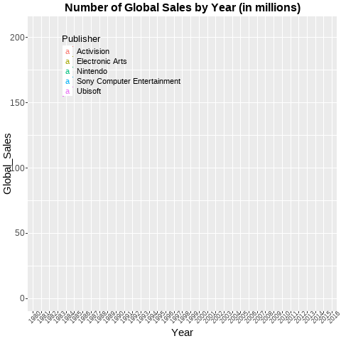
</a>

Cool stuff, right? ggplot2 is probably my favorite library in any language that I’ve used.

We can see that some of the biggest names in the industry follow a similar trend, with EA having a big jump in 2001–2003 with successful titles like Need for Speed Underground, Madden, FIFA, Medal of Honor, and more. Sony didn’t have as high sales as the rest but nevertheless still published historic franchises like Gran Turismo, Crash Bandicoot, God of War, Uncharted, LittleBigPlanet (a personal favorite), and others.

<div style="text-align: center; padding: 20px 0; letter-spacing:10px;">• • •</div>

### **Gaming Market Crash of the 1980s**

One last thing I wanted to explore is the market crash of the 1980s. In the early 80s, the market was worth around $3 billion and dropped to ~$100 million by the mid-80s. It was a drastic crash that was caused by a number of factors:

- The market was flooded with poor quality games and consoles.
- Personal computers were starting to rise in the market.
- Atari was the biggest at this time. Their release of E.T. was considered to be the killer of Atari and worst video game of all time, although it wasn’t the primary factor for the market crash.
- The poor quality games made consumers lack confidence in the future of the industry.

This crash should be reflected in the data, let’s check it out.

```R
atari_crash <- vgsales_clean[is.element(vgsales_clean$Year, c('1980', '1981', '1982', '1983', '1984', '1985', '1986', '1987', '1988', '1989', '1990')),]
atari_crash_sales <- aggregate(atari_crash$Global_Sales, by = list(atari_crash$Year, atari_crash$Publisher), FUN = sum)

colnames(atari_crash_sales)[1] <- "Year"
colnames(atari_crash_sales)[2] <- "Publisher"
colnames(atari_crash_sales)[3] <- "Global_Sales"

atari_crash_sales %>%
  mutate(label = if_else(Publisher == c("Nintendo", "Atari", "Activision"), Publisher, NA_character_)) %>%
  ggplot(., aes(x=Year, y=Global_Sales, group=Publisher, color = Publisher)) +
  geom_line(size = 1, aes(color= Publisher)) +
  ggtitle("Number of Global Sales by Year (in millions)") +
  theme(plot.title = element_text(size = 12, face = "bold", hjust = .5),
        axis.text.x = element_text(angle = 45, size = 7),
        legend.position = "none") +
  scale_color_manual(values=c("#a6a6a6", "green", "#a6a6a6", "orange", "#a6a6a6", "#a6a6a6", "#a6a6a6", "#a6a6a6", "#a6a6a6", "#a6a6a6", "#a6a6a6", "#a6a6a6", "#a6a6a6", "#a6a6a6", "#a6a6a6", "#a6a6a6", "#a6a6a6", "#a6a6a6", "#a6a6a6", "#a6a6a6", "#a6a6a6", "#a6a6a6", "#a6a6a6", "#ff66c4", "#a6a6a6", "#a6a6a6", "#a6a6a6", "#a6a6a6", "#a6a6a6", "#a6a6a6", "#a6a6a6", "#a6a6a6", "#a6a6a6", "#a6a6a6", "#a6a6a6", "#a6a6a6")) +
  geom_label_repel(aes(label = label), nudge_x = 1, na.rm = TRUE, size = 3.5)
```

<a href="../assets/GlobalSales2.png" class="glightbox">
  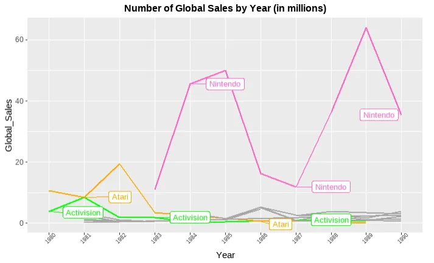
</a>

As expected, we see a major crash in 1983 for Atari and an overall low point for all other publishers during the 1980s. When Nintendo shifted focus to the western world with the re2lease of the Nintendo Entertainment System in 1985, we see the sales of video games begin to revitalize. The NES had stricter quality standards for third-party developers, so the same crash that Atari saw does not happen again. Nintendo did see a dip in 1986 but bounced back with the widely successful releases of Super Mario Bros. 2 & 3, and Tetris.

<div style="margin-left: 20px;">
<span style="font-size: 1.5em; font-weight: 200;"><a href="https://en.wikipedia.org/wiki/Video_game_crash_of_1983" target="_blank" rel="noopener noreferrer"><ins>Read more about the video game market crash</ins></a> </span>
</div>

<div style="text-align: center; padding: 20px 0; letter-spacing:10px;">• • •</div>

### **Conclusion**

Phew! We’ve made it to the end. That was fun though. I hope you had as much fun as I did doing this analysis. We found out a lot of meaningful insights about video games and even learned a bit of history. If you have any questions or feedback please feel free to connect with me on [LinkedIn](https://www.linkedin.com/in/nahomsososa/).

> Data found on: [Kaggle](https://www.kaggle.com/datasets/gregorut/videogamesales) Original data source: [VGChartz](https://www.vgchartz.com/)